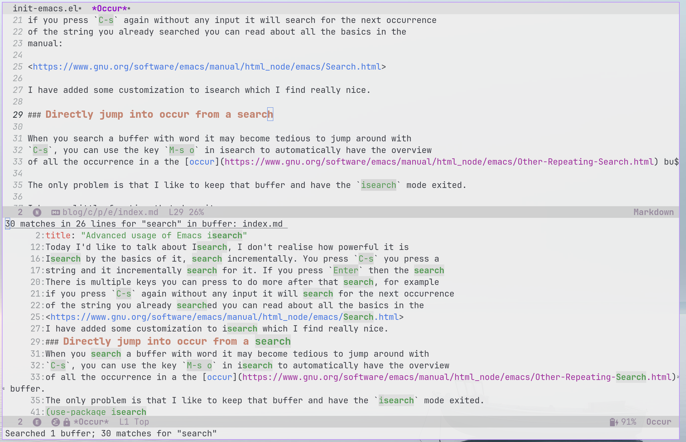
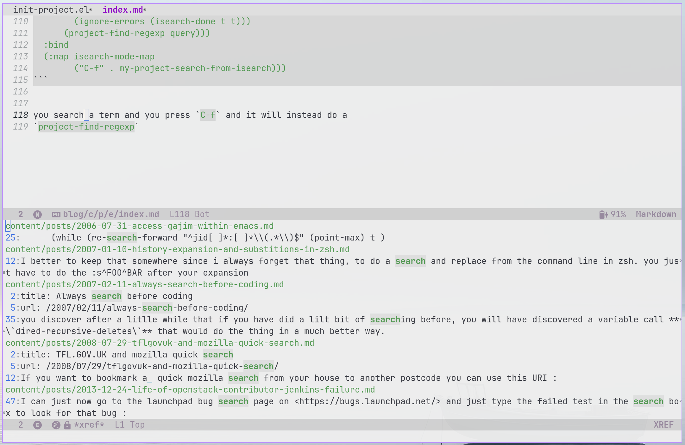

## Introduction

It has been a long time since I have blogged about Emacs. I still enjoy using it
as day one (around 1998) even tho I have now moved out of the Emacs keybindings
to the evil keybinding as long as being proficient using Neovim (for terminal
editing) or Vscode (for the debugger).

Today I'd like to talk about Isearch, I don't realise how powerful it is
compared to when using to the other editors out of the box and when you
customize it.

Isearch by the basics of it, search incrementally. You press C-s you press a
string and it incrementally search for it. If you press Enter then the search
finishes.

There is multiple keys you can press to do more after that search, for example
if you press C-s again without any input it will search for the next occurrence
of the string you already searched you can read about all the basics in the
manual:

<https://www.gnu.org/software/emacs/manual/html_node/emacs/Search.html>

I have added some customizations to isearch which I find really nice and have
them listed in this blog post.

### Directly jump into occur from a search

When you search a buffer with word it may become tedious to jump around with
`C-s`, you can use the key `M-s o` in isearch to automatically have the overview
of all the occurrence in a the [occur](https://www.gnu.org/software/emacs/manual/html_node/emacs/Other-Repeating-Search.html) buffer.

The only problem is that I like to keep that buffer and have the `isearch` mode exited.

I have a little function that does it:

```elisp
(use-package isearch
  :ensure nil
  :defer t
  :config
  (defun my-occur-from-isearch ()
    (interactive)
    (let ((query (if isearch-regexp
               isearch-string
             (regexp-quote isearch-string))))
      (isearch-update-ring isearch-string isearch-regexp)
      (let (search-nonincremental-instead)
        (ignore-errors (isearch-done t t)))
      (occur query)))
  :bind
  (:map isearch-mode-map
        ("C-o" . my-occur-from-isearch)))
```

I simply press `C-s` a search term and then `C-o` and I'll get a nice window of
all occurrences
of that search in the current buffer,



Since I have configured my `display-buffer-alist` variable the occur windows
automatically get focused and I can just press a `n`, `p` to go to the next or
previous occurrence and `q` to discard the window. Here is a snippet of my
configuration:

```elisp
(defun my-select-window (window &rest _)
  "Select WINDOW for display-buffer-alist"
  (select-window window))
(setq display-buffer-alist
      '(((or . ((derived-mode . occur-mode)))
         (display-buffer-reuse-mode-window display-buffer-at-bottom)
         (body-function . my-select-window)
         (dedicated . t)
         (preserve-size . (t . t)))))
```

As a side note, I never really understood how `display-buffer-alist` worked before
watching prot's excellent video and blog post available here:

<https://protesilaos.com/codelog/2024-02-08-emacs-window-rules-display-buffer-alist/>

### Do a project search from a search term

Now that little function which I used for occur could be generalised and
extended for other type of search.

For example you can do a project search out of the current search word instead of
limiting ourselves to the current buffer:

```elisp
(use-package isearch
  :ensure nil
  :defer t
  :config
  (defun my-project-search-from-isearch ()
    (interactive)
    (let ((query (if isearch-regexp
               isearch-string
             (regexp-quote isearch-string))))
      (isearch-update-ring isearch-string isearch-regexp)
      (let (search-nonincremental-instead)
        (ignore-errors (isearch-done t t)))
      (project-find-regexp query)))
  :bind
  (:map isearch-mode-map
        ("C-f" . my-project-search-from-isearch)))
```

you search a term and you press `C-f` and it will instead do a
`project-find-regexp`



Note that not much as changed between those two functions, and you can easily
generalise this with a
[macro](https://www.gnu.org/software/emacs/manual/html_node/elisp/Macros.html)
or a function.

### Use the current selection for the initial search (if set)

This comes from an idea on a rather old reddit post here:

<https://www.reddit.com/r/emacs/comments/2amn1v/isearch_selected_text/cixq7zx/>

This uses the current selection for the initial selection. I can use evil
operator to do any sort of selection and then press `C-s` and it will use that
selection to do the search:

```elisp
  ;; use selection to search
  (defadvice isearch-mode (around isearch-mode-default-string (forward &optional regexp op-fun recursive-edit word-p) activate)
    (if (and transient-mark-mode mark-active (not (eq (mark) (point))))
        (progn
          (isearch-update-ring (buffer-substring-no-properties (mark) (point)))
          (deactivate-mark)
          ad-do-it
          (if (not forward)
              (isearch-repeat-backward)
            (goto-char (mark))
            (isearch-repeat-forward)))
      ad-do-it))
```

### Select the current symbol at point easily for the search

Usually you want to select the current symbol to start the search, there is
multiple way to do this. In `evil` I can do a selection with `vio` to select the
current symbol and thanks to the defadvice in the previous tip it would
automatically select that symbol for search.

Emacs has a [builtin
way](https://www.gnu.org/software/emacs/manual/html_node/emacs/Symbol-Search.html)
to do this using `M-s .` but I find both way too slow.

I remapped the key in isearch mode to `C-d` to make this easier since close to
`C-s`, I can just do `C-s C-d` and I'll get that symbol filled:

```elisp
(use-package isearch
  :ensure nil
  :defer t
  :bind
  (:map isearch-mode-map
        ("C-d" . isearch-forward-symbol-at-point)))
```

### Use consult to jump onto the search occurrence

Sometime I want to have a interactive way to jump into the current search word,
you can use `consult-line` from the [consult](https://github.com/minad/consult)
package to jump interactively. But if you want to jump from the current isearch
term you can just use that simple function from earlier and add consult-line
like this:

```elisp
(use-package consult
  (:map isearch-mode-map
        ("C-l" . my-isearch-consult-line-from-isearch))
  (defun my-isearch-consult-line-from-isearch ()
    "Invoke `consult-line' from isearch."
    (interactive)
    (let ((query (if isearch-regexp
               isearch-string
             (regexp-quote isearch-string))))
      (isearch-update-ring isearch-string isearch-regexp)
      (let (search-nonincremental-instead)
        (ignore-errors (isearch-done t t)))
      (consult-line query))))
```

I start a search and press `C-l` and it jumps directly to `consult-line` which I
can further do things with it:


### Use avy to jump to the search results on screen

[Avy](https://github.com/abo-abo/avy) let you jump to words and other things via
labels, I use for all sort of things (my favourite way is combined with evil
with [evil-avy](https://github.com/louy2/evil-avy) package). You can do this
from isearch with avy:

```elisp
(use-package avy
  :bind
  (:map isearch-mode-map ("C-j" . avy-isearch))
```

I start a search term, press `C-j` when there is multiple occurrences on screen,
and then select the label to directly jump to it instead of having to do
multiples `C-s`.


### Use anzu to replace the current search term across the buffer

[anzu](https://github.com/emacsorphanage/anzu) is a pretty nice library to do
interactive replacement in Emacs. I combine it with isearch, replacing the
builtin `isearch-query-replace`:

```elisp
(use-package anzu
   :map
   isearch-mode-map
   ([remap isearch-query-replace]        . anzu-isearch-query-replace)
   ([remap isearch-query-replace-regexp] . anzu-isearch-query-replace-regexp)
   ("C-h"                                . anzu-isearch-query-replace))
```

I start a search and do a `C-h` and it will ask me for a new name to replace
that word to something else.


## Conclusion

There is other multiple way to supercharge the Emacs Search and it's probably
just a glimpsee of what I do for my search need. There is as well the fantastic
[deadgrep](https://github.com/Wilfred/deadgrep) package which I use often with
the `deadgrep-edit-mode` function to do quick replacement over a project.
