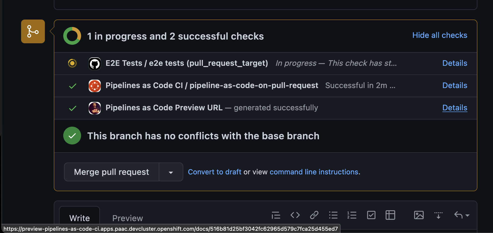

On [`Pipelines as
Code`](htps://github.com/openshift-pipelines/pipelines-as-code) we started to
get a nice documentation website on :

<https://pipelinesascode.com>

The website is a statically generated website based on
[Hugo](https://gohugo.io/) hosted on [CloudFares
Pages](https://pages.cloudfare.com) using the markdown files from the
repository.

So far this is pretty standard but when we wanted to get preview URLS like
`netlify` does with `cloudfare` it seems that previews url would not be
processed on `Pull Request` coming from forks but only from branch coming from
the same repository.

Since we do our own dogfood, I started to implement a preview environement
mechanism with Tekton and `Pipelines as Code` to get a link with the changes
from the pull requst if the `doc/` folder is modified.

I have again used my toy webserver,
[`go-simple-uploader`](https://github.com/chmouel/go-simple-uploader) to be
able to serve files, but first I had to make a few changes to it:

* Added an OpenShift Route to dircetly expose it to the internet. It previously
  was only accessible via the local kubernetes service across pods.

* I added a capability to be able to send a tarball when uploading, so we can
  upload a tarball of a folder and stream directly to `go-simple-uploader`
  which will uncompress it on the fly.

* I modified the server to add authentication to the `/upload` endpoint via a
  username and password. Just to make sure nobody abuse from it.

So far so good after having the new image deployed on our cluster, I started to
modify our `Pipelines as Code`/`Tekton` template in the `.tekton` directory to
start generating the preview env on pull requests.

The whole bits added is here :

```yaml
      - name: build-doc
        runAfter:
          - fetchit
        taskSpec:
          workspaces:
            - name: source
          steps:
            - name: hugo-gen
              image: quay.io/thegeeklab/hugo
              workingDir: $(workspaces.source.path)
              script: |
                git fetch origin main && \
                  git diff --name-only FETCH_HEAD | grep -q '^docs/' || exit 0
                cd docs
                sed -i '1acanonifyURLs = true' config.toml
                hugo --gc --minify -d {{ revision }} -b https://preview-pipelines-as-code-ci.apps.paac.devcluster.openshift.com/docs/{{ revision }}
                echo "Preview URL: https://preview-pipelines-as-code-ci.apps.paac.devcluster.openshift.com/docs/{{ revision }}"
            - name: upload-to-static-server
              # it has curl and we already pulled it
              image: registry.redhat.io/rhel8/go-toolset:1.16.12-7
              workingDir: $(workspaces.source.path)
              env:
                - name: HUB_TOKEN
                  valueFrom:
                    secretKeyRef:
                      name: "nightly-ci-github-hub-token"
                      key: "hub-token"
                - name: UPLOADER_UPLOAD_CREDENTIALS
                  valueFrom:
                    secretKeyRef:
                      name: "uploader-upload-credentials"
                      key: "credentials"
              script: |
                cd docs
                [[ -d {{ revision }} ]]  || exit 0
                tar czf - {{ revision }} | curl -u ${UPLOADER_UPLOAD_CREDENTIALS} -F path=docs -F targz=true -X POST -F file=@- http://uploader:8080/upload
                # Post as status
                set +x
                curl -H "Authorization: Bearer ${HUB_TOKEN}" -H 'Accept: application/vnd.github.v3+json' -X POST https://api.github.com/repos/{{repo_owner}}/{{repo_name}}/statuses/{{revision}} -d '{"state": "success", "target_url": "https://preview-pipelines-as-code-ci.apps.paac.devcluster.openshift.com/docs/{{ revision }}", "description": "Generated with brio.", "context": "Pipelines as Code Preview URL"}'

```

On the first step we start detecting if we had any changes in the `doc/` folder
using some git trickery with `FETCH_HEAD`, if we didn't have any we will just
`exit 0` and skip it.

If we have some changes, we add a setting to the hugo `config.toml` file to set
`cannonifyURLs=true` so we get canon urls instead of relative.

We are then generating the documentation using `hugo` and we add the new base
which goes to our public `route` URL and the commit sha (via `Pipelines as
Code` variable expansion).

We have another step just after, that would use the username and password from
a secret on a cluster and tar gz the new `docs/` folder on the file to
`go-simple-uploader` which will upload it and uncompress it on the service.

At the end to be able to preview URL, I wasn't sure which place to put it, we
could do slack or as a comment of the pull request but this quickly become
ignore and spammy. Instead, I used the GitHub `statuses` API to post the link
inside the pull request in the CI status place of GitHub, just a click away to
be previewed.

### Links

* [`Pipelines as Code`](https://github.com/openshift-pipelines/pipelines-as-code)
* [`Pipelines as Code pull request template`](https://github.com/openshift-pipelines/pipelines-as-code/blob/main/.tekton/pull-request.yaml)
* [`Go Simple Uploader`](https://github.com/chmouel/go-simple-uploader)


