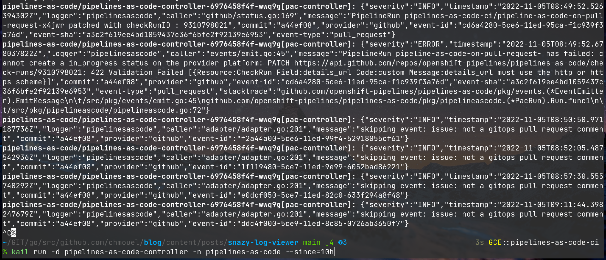
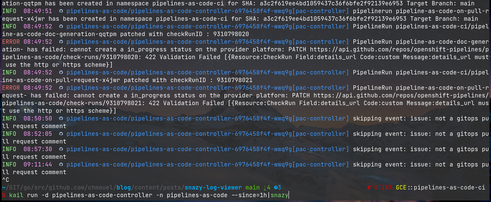

I have been meaning to write an article about tools that I have developped
lately to make it easier for my day to day life work.

Being a so called "kubernetes cloud native developer" (don't laugh at the title
because I do) I have to watch a log of controller logs. Most controller logs
output in JSON format which is a nice tool for computers but not really easily
parseable to the eyes for us mere mortals.

As I was getting more annoyed trying to spot my errors in my
controller, I quickly wrote a python script calling it [sugarjazy](github.com/chmouel/sugarjazy) which makes the log output from this :


to this :


I was happy with it and it did job nicely  (altho slightly slowly), python makes
it easy to quickly iterate, the cheer nature of the language being all dynamic
and flexible in all kind of way made it easy to parse any sorts of json log.  I
think I spent 30 minutes to write it 30 minutes to package it and was done with
it.

But I was at the same time trying to find a pet project to learn rust and I
thought it would be a good idea to rewrite it in rust.

and boy I was in for a ride....

I read tons and tons of materials on rust, I read the book, I read blog
articles, I read stackoverflow obscure answer to anything, I abused github's
codeassist. I didn't actually understand very well what I was doing but after a
few days I was able to write a very basic version of it in rust.

After that I improved and tried to iterate and improve it, trying to figure out
the best practice and the best way to do things.

It still IMHO pretty bad and probably yet another rewrite to make it proper
Rust, but the good thing with Rust is when it compiles you are pretty confident
it's not going to crash and burn.

The tool was randomly called [snazy](github.com/chmouel/snazy) (because I was
lazy to find a better name) and it was doing what the python version was doing
but in rust (in a much faster way) but with a lot more features.

Here is a list of them :

- When you use the `-r` flags (and you can have multiple of them) you tell snazy
to highlight a regexp in the logs to get to quickly spot the word you need when
it appears :


- You can skip some lines you don't want to see with the `-S` flag.

- You can filter the log levels you want to see with the `-f` flag (multiple `-f` is accepted for multiple levels)

- You can have an action when some word appears. This is pretty useful for example to be able to get notified when something was successfull or failed. For example on OSX you can do something like this :

```shell
snazy --action-regexp "script(s)?\s*.*has successfully ran" --action-command "osascript -e 'display notification \"{}\"'"
```

and whenever we have the regexp "script has successfully ran" in the logs, you will get a notification on your mac. (see [notify-send](https://www.mankier.com/1/notify-send) for how to do that on linux)

- If you want some fancy emojis instead of just boring messages, you can use the `--level-symbols` flag (or set the environment variable `SNAZY_LEVEL_SYMBOLS` in your shell) :


- One  other feature that is most useful for us "cloud native developers" having to watch multiple containers at the same time. Is the integration with [kail](https://github.com/boz/kail). Kail is a tool that allows you to watch multiple containers at the same time. You can use it with snazy like this. Whenever `snazy` detects that you are piping the output of `kail` it will automatically  show it nicely. You will go from this :



to this :



The blue string is the `namespace/pod[container]` format, if that's a bit too verbose you can use the flag `--kail-prefix-format` or `SNAZY_KAIL_PREFIX_FORMAT` to change it to something else. For example me, I am only interested with pods so I have this set :

```shell
export SNAZY_KAIL_PREFIX_FORMAT="{pod}"
```

and I get this :


and that's mostly it...

I probably should write about my ongoing experience learning Rust and figuring
release and packaging and all that stuff but I think I will do that in another
article.

Until then feel free to grab  snazy from here: <https://github.com/chmouel/snazy>
and happy humm log viewing.
